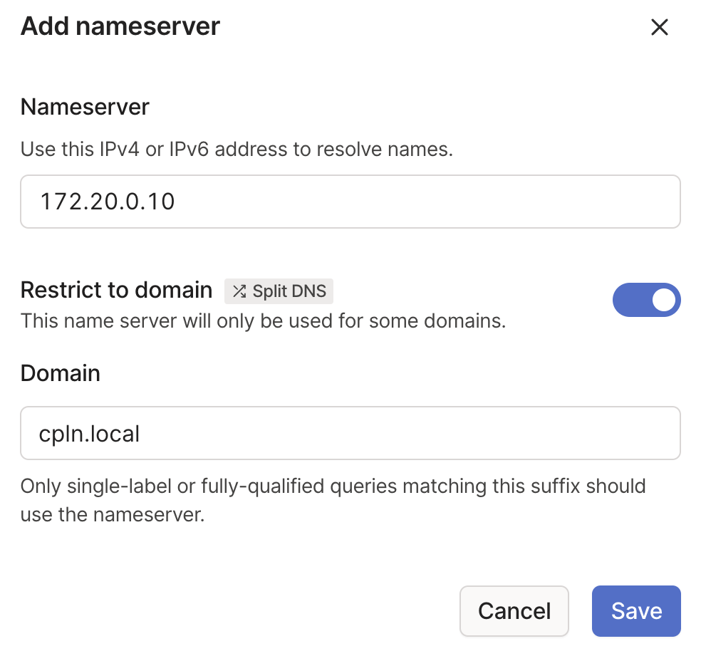
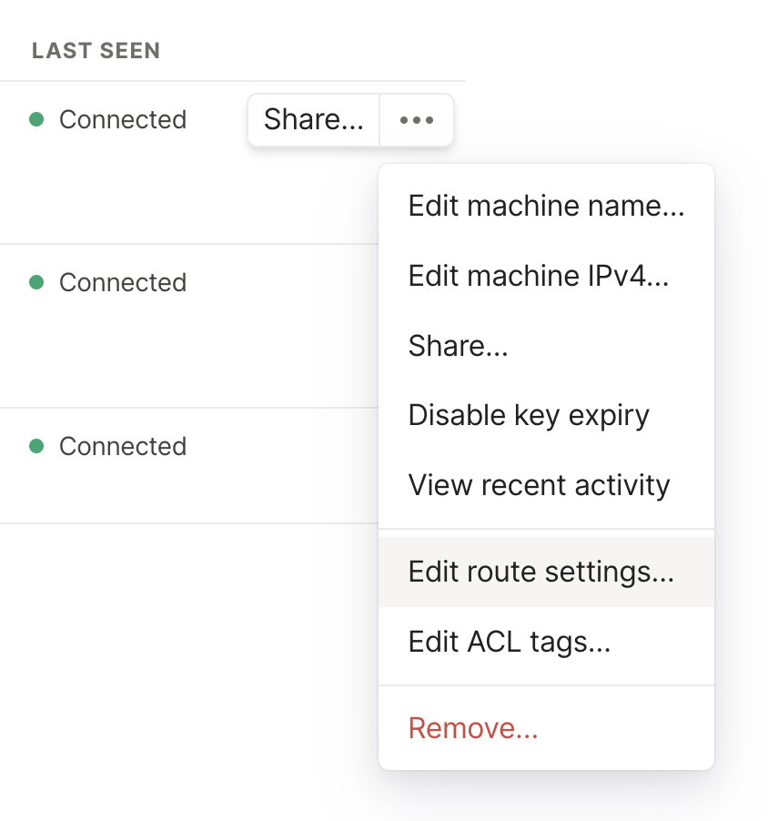
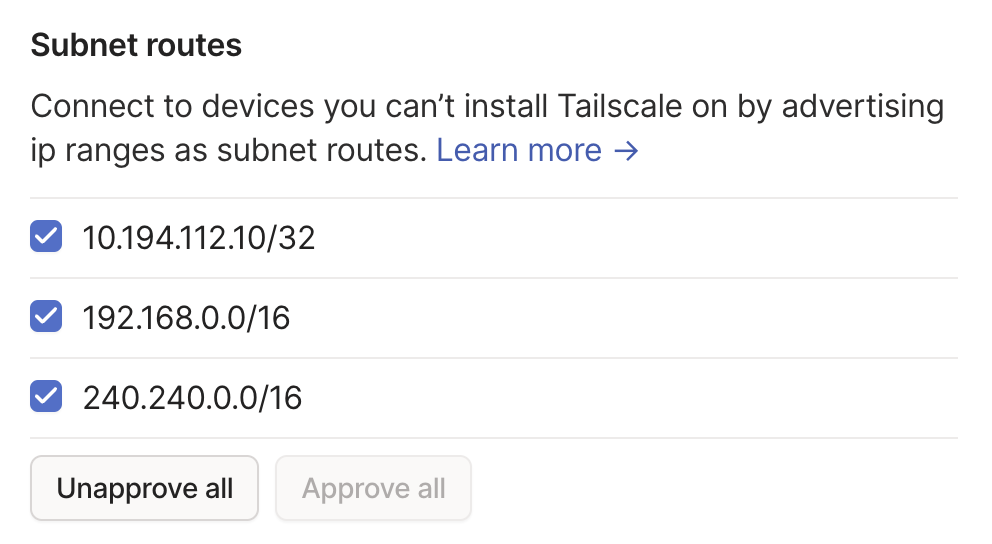

## Tailscale Gateway Workload

This example creates a workload in your Control Plane GVC that connects to your tailscale network. It publishes routes for other workloads running on Control Plane as well as for the internal dns servers so that workloads can be accessed from anywhere using the `cpln.local` endpoint.

Any workload that allows access from this tailscale workload will be able to be reached when connected to the tailscale network.

### Configure Tailscale

1. Create an Auth key using the Tailscale [admin website](https://login.tailscale.com/admin/settings/keys) and save the value for use later in this guide ($TS_AUTHKEY). Be sure to enable the `Reusable` and `Ephemeral` options for the key.

1. In the Tailscale Admin UI modify the existing [acl](https://login.tailscale.com/admin/acls/file) to include the following autoApprovers section:

   ```json
   {
     // Access control lists.
     "acls": [
       // Match absolutely everything.
       // Comment this section out if you want to define specific restrictions.
       { "action": "accept", "users": ["*"], "ports": ["*:*"] }
     ],
     "ssh": [
       // Allow all users to SSH into their own devices in check mode.
       // Comment this section out if you want to define specific restrictions.
       {
         "action": "check",
         "src": ["autogroup:member"],
         "dst": ["autogroup:self"],
         "users": ["autogroup:nonroot", "root"]
       }
     ],
     "autoApprovers": {
       "routes": {
         // cpln internal
         "192.168.0.0/16": ["autogroup:member"],
         "240.240.0.0/16": ["autogroup:member"],
         "10.0.0.0/16": ["autogroup:member"],
         // aws
         "172.20.0.10/32": ["autogroup:member"],
         // azure
         "10.1.0.10/32": ["autogroup:member"],
         // gcp-us-east1
         "10.194.112.10/32": ["autogroup:member"]
       }
     }
   }
   ```

   1. In the Tailscale Admin UI DNS Tab, add a custom nameserver for `cpln.local`:

      

### Add the tailscale workload:

**HELM**

The [Helm CLI](https://helm.sh/docs/intro/install/#through-package-managers) must be installed.

1. Clone this repo and update the `values.yaml` file as needed.

   The `gvc` parameter must be an existing GVC. It is ideal for it to be an existing GVC with workloads that you would like to reach locally.
   The `location` parameter must be an active location for the GVC or the tailscale workload will not run in any location.

1. Run the command below from this directory replacing `$TS_AUTHKEY` with the tailscale authorization key created above.

   ```bash
   cpln helm install --set AuthKey=$TS_AUTHKEY tailscale

   ```

1. Inspect the workloads, verify that the tailscale workload is registered and access the external endpoint of the nginx workload.

   1. Check the Control Plane console to verify that the workloads are running and healthy:

      https://console.cpln.io/

   1. Check the Tailscale Admin UI [Machines tab](https://login.tailscale.com/admin/machines) to verify that the cpln-test machine is connected:

      1. Click the "..." options for the machine and select "Edit route settings...".

         

      1. Verify that the routes are all approved.

         

   1. Verify that your local machine is also connected to the same tailscale network.

      

   1. Try to connect to the httpbin workload using the Control Plane internal endpoint from you local machine. You can also complete this step by opening a web browser.

      Replace the $GVC with the one specified in the values.yaml file above.

      ```bash
      curl httpbin.$GVC.cpln.local:80/headers
      ```

   1. Any additional workloads that you would like to reach can be updated so that the internal firewall allows access from the tailscale workload.

### Cleanup

**HELM**

```bash
cpln helm uninstall tailscale
```
